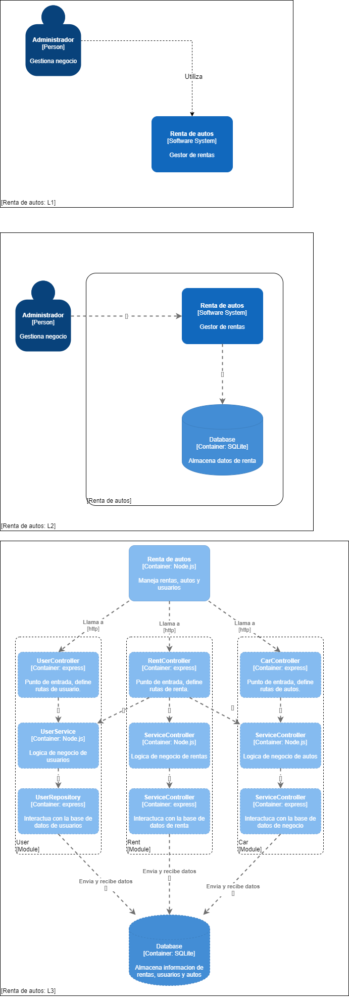

# Renta de autos
Sistema de alquiler de autos (ABM)

## Instalación de proyecto:

Correr el siguiente comando:

``` 
npm install
```
Una vez instalado, para usar las variables de entorno crea otro archivo igual a ".env.dist" en el root del directorio y cambiarle el nombre a ".env"

### Scripts:
```
npm run dbconfig # inicia configuración de base de datos con ejemplos
npm run dev # inicia el proyecto en modo desarrollo
npm run test # corre test de jest y recolecta code coverage
npm run test:all # corre todos los tests de manera continua
npm run test:cars # corre solo los tests del modulo de cars
npm run test:users # corre solo los tests del modulo de users
npm run test:rent # corre todos los test del modulo de rent
```
## Diagrama C4
